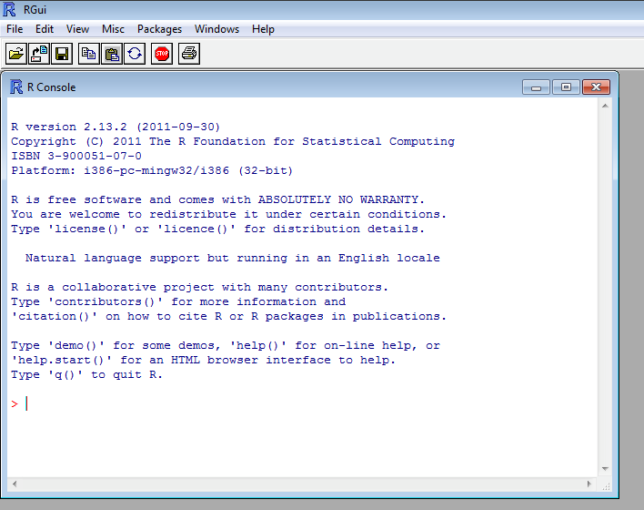
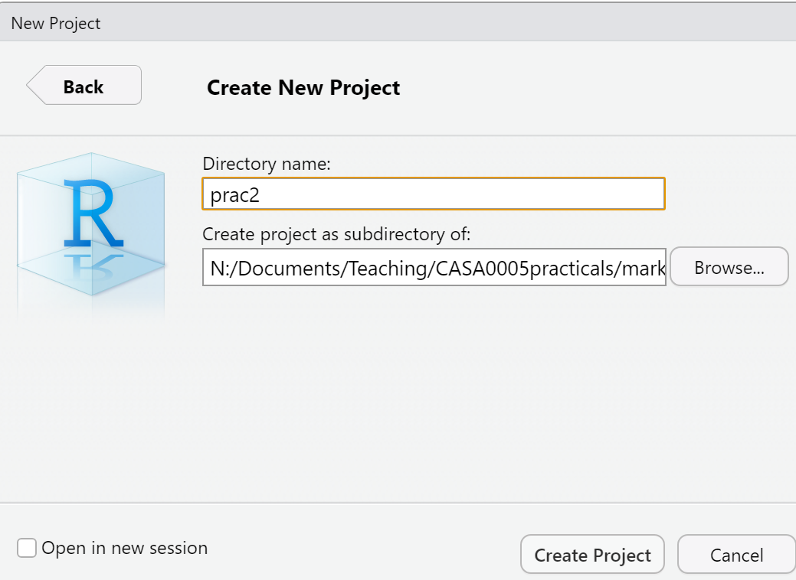

# Introduction 

This Practical is **LONG** but it will take you from not knowing anything about R to making freaking cool interactive maps in one practial. As you can imagine, this will be a steep learning curve.

I will give you all the code you need, it’s your job to read through the text very carefully and try to understand what bits of code are doing as you go.

There will be bits of code you don’t fully understand. Don’t worry, the key is to revisit later and try to work out what is going on then. Learning R is a long and iterative process and this is just the start…

If you want to learn more about R and indeed download the latest version for your own use, then visit the R project pages: http://www.r-project.org/

The Wikipedia page for those who want to know a little of the history of R can be found here: http://en.wikipedia.org/wiki/R_(programming_language)

There is an almost endless supply of good R tutorials on the web. If you get stuck or want to learn even more R (and why would you not want to?!), I’d recommend trying some of the following R Tutorial websites:

* http://www.statmethods.net/index.html

* http://www.r-tutor.com/

* http://www.cyclismo.org/tutorial/R/index.html

* http://www.cookbook-r.com/

If you want to really be up to date with the state of the art in R, then https://bookdown.org/ is a fantastic resource. It features free books by some of the pre-eminent names in the R scene - I would urge you to go and take a look.

# Learning outcomes

*
*
*
*

## Online forums are your friend!!

With almost every problem you encounter with R, someone else will have had the same problem before you and posted it on a forum – someone will then post a solution below.

My usual route is to google the problem and I’ll then be directed to a post, usually on StackOverflow, StackExchange or CrossValidated. I’ve rarely not found a solution to a problem this way.

## Health warning

Beware of posting questions on these forums yourself – contributors to these forums (especially the R ones!), whilst almost always extremely knowledgeable about R, have a bit of a reputation for being insert familiar pejorative term for less-than-polite-human-being here! As you might expect, people who have enough time to become total experts in R, have little time to work on their social skills!! Fortunately though, some other poor chump has usually taken that hit for you and you can still find a useful answer to your problem.

If you are specifically more interested in the spatial side of R, then Alex Singleton and Chris Brunsdon at the Universities of Liverpool and Maynooth also have a number of very useful R Spatial Tutorials – http://rpubs.com/alexsingleton/ & http://rpubs.com/chrisbrunsdon/

Robin Lovelace in Leeds is also frequently at the bleeding edge of developments in R spatial stuff, so keep an eye on his website too: http://robinlovelace.net/. Robin is also in the process of completing a book on GeoComputation in R, which you should definitely read! - https://geocompr.robinlovelace.net/

These websites are also very very good: https://pakillo.github.io/R-GIS-tutorial/ and http://www.maths.lancs.ac.uk/~rowlings/Teaching/UseR2012/cheatsheet.html

## R and RStudio

When you download and install R, you get the R Graphical User Interface (GUI) as standard (below). This is fine and some purists prefer using the clean, unfussy command-line original, but it has some limitations such as no graphical way to view data tables or keep track of what is in your working directory (there are a number of others too).

```{r echo=FALSE, out.width = "500px", fig.align='center'}
 
```

Fortunately there are a number of software environments that have been developed for R to make it a little more user-friendly; the best of these by a long way is RStudio. RStudio can be downloaded for free from https://www.rstudio.com/. We covered the RStudio layout last week.

## Getting started

If you are some kind of masochist, you are welcome to use the bundled R GUI for all of your work. If pain is not your thing, then for this practical (and future practicals) I will assume that you are using RStudio.

1. From the start menu on your computer, find and run R Studio

Once RStudio has opened, the first thing we will do is create a new project – projects enable you to organise your work effectively and store all of the files you create and work with for a particular task. 
2. To create a new project (and this will vary a little depending on the version of RStudio you are using), either select File > New Project… or Project > Create Project

```{r echo=FALSE, out.width = "500px", fig.align='center'}
knitr::include_graphics('prac2_images/r_newproject.png') 
```

3. Select Start a project in a brand new working directory and create a new project in a directory of a new ‘wk2’ directory on your N: drive:

```{r echo=FALSE, out.width = "500px", fig.align='center'}
 
```

My file directory (the second box here) will be different to yours as this is my teaching resources folder. Keep yours simple N:/GIS/wk2.

RStudio should now open with three windows – the main R console on the left, with windows for your environment and files on the right.

## Basics 

1. R has a very steep learning curve, but hopefully it won’t take long to get your head around the basics. For example, at its most simple R can be used as a calculator. In the console window (bottom left), just type the following and press enter:

```{r}
1+5
```

or 

```{r}
4*5^2
```

As you can see R performs these calculations instantly and prints the results in the console. This is useful for quick calculations but less useful for writing scripts requiring multiple operations or saving these for future use.

2. To save your scripts, you should create a new R Script file. Do this now: Select File > New File > R Script.

3. The R Script should open up on the top-left of your GUI. **From now on type everything in this R script file and save it**

## R Scripts and some basic R commands

4. Usually one of the first things to do when starting a new R Script is to check that you are in the correct working directory. This is important especially if you are working on multiple projects in different locations. To do this type the following into your new empty R Script:

```{r}
getwd()
```

5. To run this line, hold *Ctrl (Cmd on a Mac) and press the Return(↲) key (if you are in the standard R installation, you would run your script with Ctrl R). You should now see your current working directory appear in the console.

6. Because of the new project we have already set up, this working directory should be correct, but if for any reason we wanted to change the working directory, we would use the setwd() function. For example, we wanted to change our directory to the documents folder on the C drive, we could run (don’t do this now):

```{r eval=FALSE}
setwd("C:/Documents")
```

7. When we are sure we are working in the correct working directory, we can save our script by clicking on the save icon on the script tab. Save your script as something like “wk2_part1” and you will see it appear in your files window on the right hand side. As you build up a document of R code, you should get into the habit of saving your script periodically in case of an unexpected software crash.

8. We can now begin to write a script without the need to run each line every time we press enter. In the script editor type:

```{r}
A <- 1
B <- 2
C <- A+B
C
```

9. Select (highlight) the three lines and run all three lines with Ctrl Return(↲). You will notice the lines appear in the console (the other window). If you type C and press enter in the console (C and then ctrl return in the script window) you should have the number 3 appear. From now on I recommend you type all the commands below in the script first and then run them. Copying and pasting from this document won’t necessarily work.

10. You will also notice that in RStudio, values A, B and C will appear in your workspace window (top right). These variables are stored in memory for future use. Try giving A and B different values and see what happens. What about if you use lower case letters?

11. You have just demonstrated one of the powerful aspects of R, which is that it is an **object oriented** programming language. A, B and C are all objects that have been assigned a value with the <- symbol (you can also use the = sign, but it operates slightly differently to <- in R, plus the arrow assignment has become standard over the years. Use **alt -** to type it automatically). This principle underlies the whole language and enables users to create ever more complex objects as they progress through their analysis. If you type:

```{r}
ls()
```
R will produce a list of objects that are currently active.

```{r}
rm(A)
```

will remove the object A from the workspace (do ls() again to check this or look in your workspace window).

## Functions

12. Both rm() and ls() are known as functions. Functions are the other fundamental aspect to the R language. Functions can be thought of as single or multiple calculations that you apply to objects. They generally take the form of:

```{r, eval=FALSE}
function(object, parameter1, parameter2, parameter3...)
```

13. You can write your own functions to carry out tasks (and we’ll come onto that in subsequent practical sessions), but normally you will just used one of the virtually infinite number of functions that other people have already written for us.

## Basic plotting

For example, one common function is the ```plot()``` function for displaying data as a graphical output. Add these lines to your script and run them as before and you can see some ```plot()``` outputs:
```{r}
#create some datasets, first a vector of 1-100 and 101-200
Data1 <- c(1:100)
Data2 <- c(101:200)
#Plot the data
plot(Data1, Data2, col="red")
```

```{r}
#just for fun, create some more, this time some normally distributed
#vectors of 100 numbers
Data3 <- rnorm(100, mean = 53, sd=34)
Data4 <- rnorm(100, mean = 64, sd=14)
#plot
plot(Data3, Data4, col="blue")
```

14. In the code above, you will have noticed the # symbol. This signifies that whatever comes after it on that line is a comment. Comments are ignored by the R console and they allow you to annotate your code so that you know what it is doing. It is good programming practice to comment your code extensively so that you can keep track of what your scripts are for.

## Help

15. The previous lines of code also demonstrated a number of functions: c() concatenates a string of numbers together into a vector. 1:100 means produce the integers between and including 1:100, the plot() function plots the two data objects and includes a parameter to change the colour of the points. To understand what a function does, you can consult the R Help system. Simply type a question mark and then the function name; for example:

```{r eval=FALSE}
?plot
```

```{r echo=FALSE, out.width = "300px", fig.align='center'}
knitr::include_graphics('prac2_images/rhelp.png') 
```

16. In RStudio you will see the help file appear in the Help window in the bottom right of the GUI. Here you can also search for the help files for other functions in the search bar.

## Data types - Data Drames

17. Objects in R can exist as a number of different data types. These include a **matrix**, a **vector**, a **data frame** and a **list**. For the purposes of this practical we will focus on data frames. These are the most flexible data format in R (although tibbles are now becoming popular as well). Data frames can be conceptualised in a similar way to a spreadsheet with data held in rows and columns. They are the most commonly used object type in R and the most straightforward to create from the two vector objects we just created.

```{r}
df <- data.frame(Data1, Data2)
plot(df, col="green")
```

18. If you have a very large data frame (thousands or millions of rows) it is useful to see only a selection of these. There are several ways of doing this:

```{r}
#show the first 10 and then last 10 rows of data in df...
head(df)
```

```{r}
tail(df)
```
You can also view elements of your data frame in RStudio by simply clicking on it in the top-right Environment window:

```{r echo=FALSE, out.width = "800px", fig.align='center'}
knitr::include_graphics('prac2_images/dataview.png') 
```

## Accessing elements of a data frame

19. When programming you will frequently want to refer to different elements in a data frame or a vector/list. To select elements of a data frame, or subset it, you can refer specifically to ranges or elements of rows and columns. These are accessed using the single square bracket operator [], with the form:

```{r eval=FALSE}
data.frame[row,column]
```

Rows are always referenced first, before the comma, columns second, after the comma.

20. Try the subsetting your df data frame with the following commands to see what is returned:

```{r}
df[1:10, 1]
df[5:15,]
df[c(2,3,6),2]
df[,1]
```

21. You will note that the column headings are the names of the original objects creating the data frame. We can change these using the ```colnames()``` function:

```{r}
colnames(df)<- c("column1", "column2")
```

To select or refer to these columns directly by name, we can either use the ```$``` operator, which takes the form  ```data.frame$columnName```, e.g.

```{r}
df$column1
```

or we can use the double square bracket operator [[]], and refer to our column by name using quotes e.g.

```{r}
df[["column1"]]
```

This again is useful if you have a lot of columns and you wish to efficiently extract one of them.

# Reading data into R

One of the most tedious things a spatial analyst / data scientist has to do is clean their data so it doesn’t cause problems for the software later. In the past, we would have needed to do this by hand - these days, we can use software to do much of this for us.

I will now give you two options to arrive at a nice cleaned dataset. If you have issues with software packages etc, you might still need to via the old skool route, however, the new skool route will be much more satisfying if it works!

For this example we are going to use the London Datastore Catalogue.

Go to: https://data.london.gov.uk/dataset/london-datastore-catalogue and download the excel document.

## Old Skool Cleaning

22. Open the ```LondonData.xls``` file in Excel, and save as ```LondonData.csv``` into your wk2/RProject folder.

23. Open your new ```.csv``` file in Excel. There might be some non-numeric values inside numeric columns which will cause problems in your analysis. These need to be removed before proceeding any further. To remove these, you can use the replace function in Excel. In the home tab under ‘Editing’ open up the find and replace dialogue box and enter the following into the find box:

```#VALUE!``` ```#n/a```

Leave the replace box empty each time and click Replace All to remove these from your file, before saving the file again.

24. Once you have cleaned out all of the trixy characters from the file, to read it into R, we will use the read.csv() function:

```{r}
LondonDataOSK<- read.csv("prac2_data/london_catalogue.csv")
```

*Note*, i've made an R project for all these practicals, which is why my file path starts with ```prac2_data/```. If you save the ```.csv``` in the same folder as the ```.Rproj``` then you can just use:

```{r eval=FALSE}
LondonDataOSK<- read.csv("LondonData.csv")
```

If you look at the ```read.csv()``` help file - ```?read.csv``` - you will see that we can actually include many more parameters when reading in a .csv file. For example, we could read in the same file as follows:

```{r}
# by default in R, the file path should be defined with / but on a #windows file system it is defined with \. Using \\ instead allows R #to read the path correctly – alternatively, just use /
LondonDataOSK<- read.csv("prac2_data/london_catalogue.csv", header = TRUE, sep = ",")
```

This would specify the exact path; that the first row of the file contains header information; and the values in the file are separated with commas (not ; or : as can be the case sometimes).

## New skool cleaning 

To clean our data as we read it in, we are going to use a package (more about packages later - for now, just think about it as a lovely gift from the R gods) called readr which comes bundled as part of the tidyverse package. If you want to find out more about the Tidyverse (and you really should) then you should start here: https://www.tidyverse.org/ - the Tidyverse package contains almost everything you need to become a kick-ass data scientist. ‘Tidy’ as a concept in data science is well worth reading about and you should start here with Hadley Wickham’s paper - http://vita.had.co.nz/papers/tidy-data.pdf

Anyway, first install the package:

```{r}
install.packages("tidyverse", repos = "https://www.stats.bris.ac.uk/R/")
```

Now we can use the readr package which comes bundled as part of the tidyverse to read in some data (directly from the web this time - read.csv can do this too) and clean text characters out from the numeric columns before they cause problems:

```{r}
library(tidyverse)
#wang the data in straight from the web using read_csv, skipping over the 'n/a' entries as you go...
LondonData <- read_csv("https://files.datapress.com/london/dataset/ward-profiles-and-atlas/2015-09-24T14:21:24/ward-profiles-excel-version.csv", na = "n/a")
```

**note the use of read_csv here as opposed to read.csv. They are very similar, but read_csv is just a bit better - read this to understand why… Also, for those python fans out there - IT’S NOT THE SAME FUNCTION AS READ_CSV IN PYTHON**

## Examining your new data

25. Your new data has been read in as a data frame / tibble (a tibble is just a data frame with a few extra bells and whistles). If you ever need to check what data type your new data set is, we can use the ```class()``` function:

```{r}
class(LondonData)
```

```{r}
# or, if you have your old skool data from step 24 above
class(LondonDataOSK)
```

We can also use the ```class``` function within another two functions (cbind() and lapply()) to check that our data has been read in correctly and that, for example, numeric data haven’t been read in as text or other variables. Run the following line of code:


